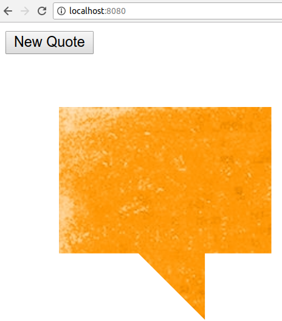

First, clone this repository:

```
git clone git@github.com:ggodreau/quote.git
```

Enter the cloned folder:

```
cd quote
```

Update npm:
``` 
sudo npm i -g npm 
```

Install the http-server:
```
sudo npm install http-server -g
```

Run the server!
```
http-server ./ -p 8080
```

Open a web browser and go here:
```
http://localhost:8080
```

Ta da!

